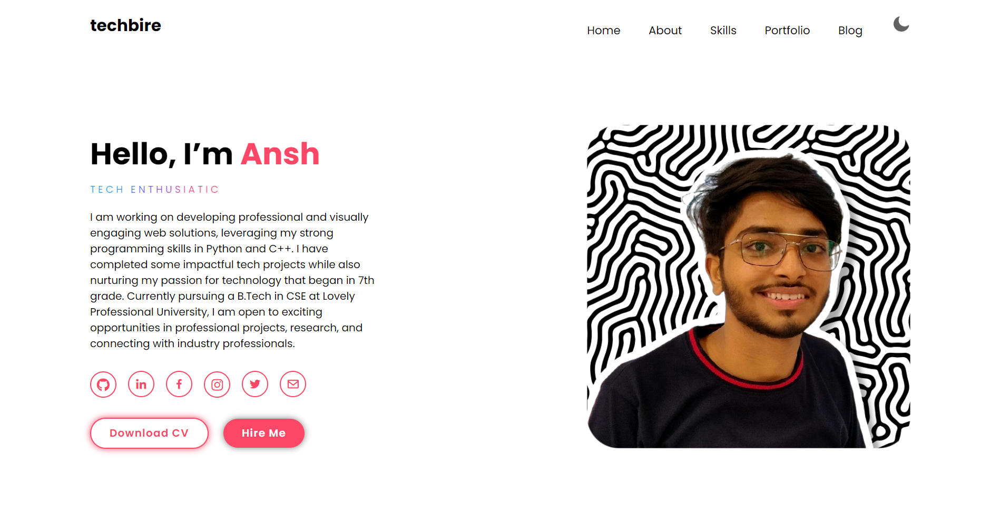
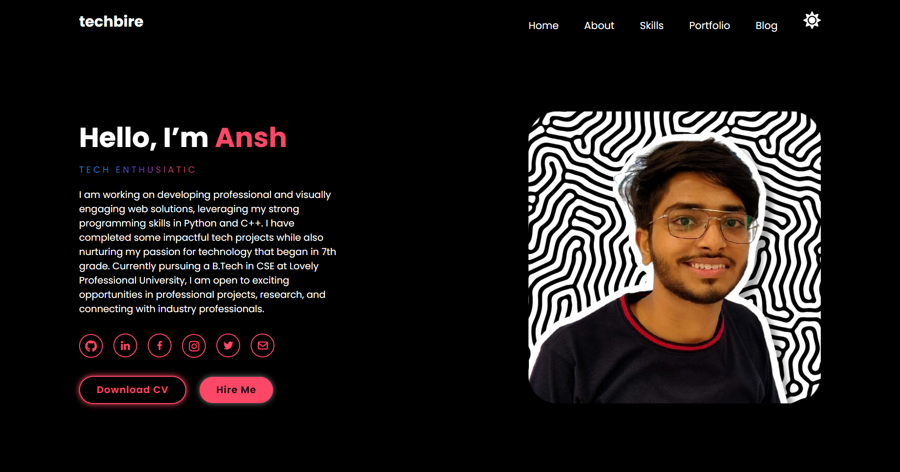

# Ansh's Portfolio Website




## Overview

Welcome to my personal portfolio website repository! This project is a showcase of my skills and projects, built using HTML, CSS, and JavaScript. It features a fully responsive contact page with Formspree integration, a dark mode for enhanced user experience, and subtle animations using AOS.

## Features

1. **Fully Responsive Contact Page:**
   - Integration with Formspree for easy form submissions.
   - User-friendly design for seamless interaction on various devices.

2. **Dark Mode:**
   - Eye-friendly dark mode for improved readability.
   - Toggle between light and dark modes easily.

3. **Animations using AOS:**
   - Subtle animations enhance the user experience.
   - Smooth animations on key elements for engagement.

## Getting Started

To view this website locally or contribute to the project, follow these steps:

1. Clone the repository:
   ```bash
   git clone https://github.com/techbire/portfolio.git
   ```

2. Open the `index.html` file in your preferred web browser.

## Usage

- Explore the various sections of the website to learn more about my skills and projects.
- Use the contact page to get in touch with me. The form is integrated with Formspree for easy communication.

## Screenshots

Include screenshots showcasing different sections and features of your website.

## Acknowledgments

- AOS Library: [Animate On Scroll Library](https://github.com/michalsnik/aos)
- Formspree: [Formspree](https://formspree.io/)

## Contact

For any inquiries or feedback, feel free to reach out to me at anshtechnical@gmail.com


