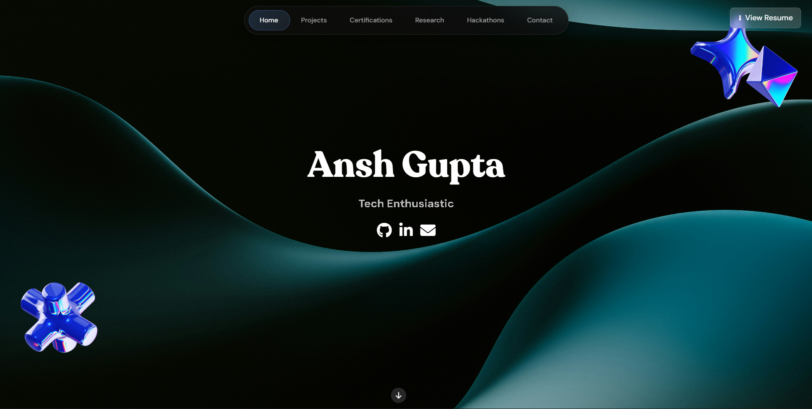

# Ansh Gupta (techbire) – Developer Portfolio



A fast, single‑page personal developer portfolio highlighting projects, skills, experience, open‑source contributions, and achievements. Built with vanilla HTML, CSS, and JavaScript (no heavy frameworks) and optimized for SEO + performance.

## 🚀 Features
- Responsive design with animated hero & morphing text
- Liquid crystal style navigation + mobile hamburger menu (< 786px)
- Interactive wobble / parallax cards
- Dynamic population of sections (projects, skills, experience, certifications, publications, hackathons)
- Lazy‑loaded images & minified assets (`styles.min.css`, `script.min.js`)
- SEO ready: meta tags, Open Graph, Twitter Card, JSON‑LD Person schema
- Accessibility: semantic structure, alt text, focusable navigation
- Sitemap + robots.txt
- Preloaded hero background for faster Largest Contentful Paint

## 🛠 Tech Stack
- HTML5, CSS3 (custom), Vanilla JavaScript (ES6 IIFE modules style)
- No build tooling required
- Font Awesome (CDN), Google Fonts (DM Sans, Inter)

## 📂 Project Structure
```
index.html
styles.css          (unminified source)
styles.min.css      (production)
script.js           (unminified source)
script.min.js       (production)
robots.txt
sitemap.xml
assets/
  favicon.ico
  ss.png            (screenshot / social preview)
  noise.webp        (overlay texture)
  images/           (project & decorative images)
```

## 🔍 SEO / Metadata Implemented
- `<meta name="description">` + focused keyword set (including: Ansh Gupta Ballia, Ansh Gupta LPU, techbire)
- Canonical URL: `https://techbire.github.io/`
- Open Graph + Twitter card (summary large image)
- JSON‑LD `Person` schema with `alternateName` variants
- `robots.txt` + `sitemap.xml`
- Preload: hero background image

If deployed under a subpath (not username.github.io), update these in `index.html`:
- Canonical, `og:url`, `twitter:url`, JSON‑LD `url` & `image` paths

## ⚡ Performance Enhancements
- Minified CSS & JS
- Defer script loading
- Lazy loading for non‑critical images
- Reduced DOM layout thrash (single pass dynamic injections)
- Blend modes + small texture (noise.webp) for aesthetic without large images

## 🧪 Suggested Lighthouse Targets (Post‑Deploy)
| Category | Target |
|----------|--------|
| Performance | 90+ |
| Accessibility | 90+ |
| Best Practices | 100 |
| SEO | 100 |

Minor improvements (optional):
- Add `lang` attribute already present (en)
- Serve images in WebP (some already are) & add width/height for CLS prevention
- Add Service Worker for PWA (optional)

## ▶ Local Preview
Just open `index.html` in a browser. (For correct font / icon loading via some browsers’ CORS policies, a lightweight static server is recommended.)

Python quick serve (choose one):
```bash
# Python 3
python -m http.server 8080
```
Then visit: http://localhost:8080

## 🗺 Deployment (GitHub Pages)
1. Create (or use) repo, push all files to `main`.
2. If you name the repo `techbire.github.io`, site auto‑deploys at root.
3. Otherwise: Settings → Pages → Deploy from Branch → `main` / root.
4. Wait a minute, verify URLs & social cards via Twitter / Open Graph debugger.
5. (Optional) Submit sitemap to Google Search Console.

## 🔄 Updating Content
- Add / edit projects: modify the `projects` array in `script.js` (and rebuild minified file if you want to replace `script.min.js`).
- Skills / Experience / Certifications / Publications / Hackathons all come from arrays in `script.js`.
- About section: edit HTML in `index.html` (`#about`).

## 🧩 Contributing
Personal site – PRs usually closed unless discussed. Feel free to fork and adapt for your own portfolio (please replace content & images).

## 📜 License
All original content (text, images branded to Ansh Gupta / techbire) is © Ansh Gupta. Code portions may be reused with attribution. Do **not** reuse personal images or proprietary logos without permission.

## 📫 Contact
- Portfolio: https://techbire.github.io/
- GitHub: https://github.com/techbire
- LinkedIn: https://www.linkedin.com/in/techbire/
- X (Twitter): https://x.com/techbire
- Email: anshtechnical@gmail.com

---
If you’d like a PWA upgrade / Service Worker or a dark–light theme toggle, open an issue or reach out.
